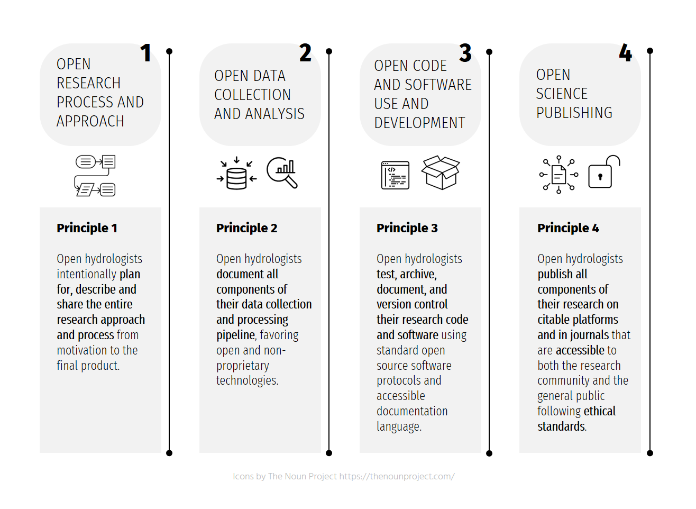

---
# Feel free to add content and custom Front Matter to this file.
# To modify the layout, see https://jekyllrb.com/docs/themes/#overriding-theme-defaults

layout: home
title: A Hydrologist's Guide to Open Science
---

Figure: The Open Hydrology Principles

### Welcome

Welcome to the community site dedicated to helping Hydrology make progress towards open science. Join the community and [subscribe](signees/) to the principles, or [contribute](contribute/) to the dicussion and practicle guide.

